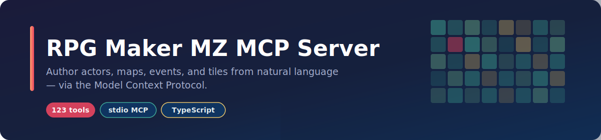
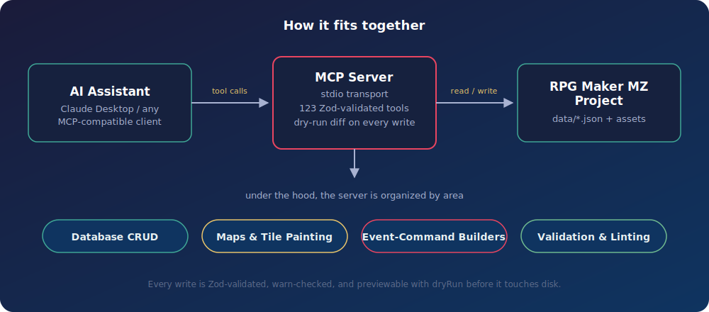

<div align="center">



# RPG Maker MZ MCP Server

[](https://github.com/Redseb/rpgmaker-mz-mcp/actions/workflows/ci.yml)
[](#available-tools)
[](https://modelcontextprotocol.io/)
[](tsconfig.json)
[](package.json)
[](#license)

**123 tools** that let an AI assistant read and write an RPG Maker MZ project directly — actors, classes, skills, items, equipment, states, enemies, troops, common events, maps, tiles, tilesets, events, and system settings — instead of hand-editing everything in the editor.

_"Add a town under the world map, paint it with grass, and drop in a shopkeeper who sells potions"_ → done, in-project, no editor clicks.

</div>

## Quick start

```bash
npm install && npm run build
export RPGMAKER_PROJECT_PATH=/path/to/your/rpgmaker/project   # dir with game.rmmzproject + data/
npm start
```

Then point any MCP client at `dist/index.js` (see [Configuration](#configuration)) and ask it to build your game. New here? Read [SETUP.md](SETUP.md) for the full walkthrough and [EXAMPLES.md](EXAMPLES.md) for end-to-end recipes.

## Contents

- [Quick start](#quick-start)
- [Capabilities](#capabilities)
- [How it fits together](#how-it-fits-together)
- [Installation](#installation)
- [Configuration](#configuration)
- [Usage](#usage)
- [Available tools](#available-tools)
- [Input validation](#input-validation)
- [Event validation (warn-by-default)](#event-validation-warn-by-default)
- [Reference linting](#reference-linting)
- [Dry-run preview](#dry-run-preview)
- [Custom-tileset catalog skill](#custom-tileset-catalog-skill)
- [Example prompts](#example-prompts)
- [Development](#development)
- [Project structure](#project-structure)
- [Safety and best practices](#safety-and-best-practices)
- [Limitations](#limitations)

## Capabilities

- **Database CRUD** — actors, classes (with learnings & param curves), skills (full-control + simplified damage/heal/buff/state helpers), items, weapons, armors, states, enemies, and troops. Only a `name` is required to create; everything else falls back to the editor's true "New X" template.
- **Maps & the map tree** — create/delete maps, batch-reparent/reorder/rename with a cycle guard, and edit map properties. New maps register in `MapInfos.json` exactly as the editor expects.
- **Tile painting (with automatic autotiling)** — `paint_tiles`/`fill_area` set tiles on any of the six map layers and recompute autotile shapes (and their neighbours') from same-kind adjacency, so a filled region borders itself correctly. `place_object` stamps multi-tile B/C objects (houses, trees) and reports their passability footprint.
- **Semantic tile catalog** — `find_tile "grass"` → a paintable tile id. Built-in catalogs for every default tileset (Overworld, Outside, Inside, Dungeon, SF), sourced from RPG Maker's own English name sidecars. A bundled vision-bootstrap skill catalogs **custom** tilesets.
- **Passability & terrain** — read a tile's flags or a map cell's layered passability (`get_tile_flags`/`check_passability`), and **edit** passability/terrain-tag/behaviour flags (`set_tile_flags`).
- **Event-command builders** — high-level, read-only builders that emit the exact `EventCommand` sequences the editor writes (including tricky recursive branch blocks and continuation rows), landed on a page via `insert_event_commands`. Covers dialogue & flow, game-state changes, presentation/transitions, and scene processing.
- **Event & NPC ergonomics** — `create_npc` places a complete talking NPC in one call; `set_event_page` merges a page's graphic + behavior in place.
- **Asset awareness** — `list_assets` enumerates valid character/face/tileset/audio names so events never reference a missing file.
- **Correctness layer** — Zod-validated inputs, warn-by-default event validation, a cross-file reference linter (`validate_references`), and a dry-run/diff preview on every write.

## How it fits together

<div align="center">

</div>

## Installation

```bash
npm install
npm run build
```

## Configuration

Set the RPG Maker MZ project path as an environment variable:

```bash
# macOS/Linux
export RPGMAKER_PROJECT_PATH=/path/to/your/rpgmaker/project

# Windows
set RPGMAKER_PROJECT_PATH=C:\path\to\your\rpgmaker\project
```

The path must point to a directory containing `game.rmmzproject` and a `data/` directory with `System.json`.

## Usage

### Running the server

```bash
npm start          # or: node dist/index.js
```

### Configuring in Claude Desktop

Add to your Claude Desktop configuration file (`%APPDATA%\Claude\claude_desktop_config.json` on Windows, `~/Library/Application Support/Claude/claude_desktop_config.json` on macOS):

```json
{
  "mcpServers": {
    "rpgmaker-mz": {
      "command": "node",
      "args": ["/path/to/rpgmaker-mz-mcp/dist/index.js"],
      "env": {
        "RPGMAKER_PROJECT_PATH": "/path/to/your/rpgmaker/project"
      }
    }
  }
}
```

## Available tools

All 123 tools, grouped by area. Tools that write to the project accept an optional `dryRun` argument (see [Dry-run preview](#dry-run-preview)).

<details>
<summary><strong>Expand the full tool reference</strong></summary>

### Actors

- `get_actors`, `get_actor`, `create_actor`, `update_actor`, `search_actors`

### Classes

- `get_classes`, `create_class`, `update_class`
- `add_class_learning` — attach a skill learned at a level (validates the skill, keeps learnings level-sorted)
- `set_class_param_curve` — replace one of the 8 parameter growth rows

### Skills

- `get_skills`, `get_skill`, `create_skill` (full control), `update_skill`, `search_skills`
- `create_damage_skill`, `create_healing_skill`, `create_buff_skill`, `create_state_skill` — natural-language-friendly helpers for common skill types

### Items & equipment

- `get_items`, `create_item`, `update_item`, `search_items`
- `get_weapons`, `create_weapon`, `update_weapon`
- `get_armors`, `create_armor`, `update_armor`

### States

- `get_states`, `create_state`, `update_state`

### Enemies & troops

- `get_enemies`, `create_enemy`, `update_enemy`
- `get_troops`, `create_troop`, `update_troop` — `create_troop` validates that every member references an existing enemy

### Common events

- `get_common_events`, `create_common_event`, `update_common_event`
- `call_common_event` — builds the code-117 call command and validates the target exists

### Maps & the map tree

- `get_map` (pass `includeData: false` to omit the tile array on a big map), `get_map_infos`, `get_map_dimensions`, `update_map`
- `get_map_region` — read a window of tile ids (x, y, width, height, layer) instead of the whole map
- `create_map` — allocates the next id, writes a blank map, and registers it in the tree
- `delete_map` — removes a map and reparents its children onto its parent
- `update_map_tree` — batch reparent/reorder/rename/expand with an up-front existence check and cycle guard

### Map events

- `get_map_events`, `get_map_event`, `search_map_events`
- `create_map_event`, `update_map_event`, `delete_map_event`
- `add_event_command` — append a single command to an event page
- `set_map_tile` — set a single raw tile id at (x, y) on a z-layer (no autotiling)

### Event & NPC ergonomics

- `create_npc` — one-shot "talking NPC": graphic + trigger + a talk list from `text` or explicit `commands`
- `create_chest` — one-shot treasure chest: the two-page self-switch idiom (give item/weapon/armor/gold, then never again)
- `create_transfer` — one-shot map transfer, in either working idiom: face a solid landmark (`action_button`) or step on a doormat (`player_touch`)
- `set_event_page` — merge a page's graphic + behavior (sprite, trigger, priority, movement, flags) in place

### Event-command builders

Read-only builders that return editor-faithful `EventCommand` sequences; land them on a page with `insert_event_commands`.

- **Dialogue & flow:** `build_show_text` (101/401), `build_show_choices` (102/402–404), `build_conditional_branch` (111/411/412), `build_flow_command` (wait/exit/label/jump)
- **Game state:** `build_control_switch` (121/123), `build_control_variable` (122), `build_change_gold` (125), `build_change_items` (126–128), `build_change_party_member` (129)
- **Presentation & transitions:** `build_transfer_player` (201), `build_play_audio` (BGM/BGS/ME/SE), `build_screen_effect` (fade/tint/flash/shake), `build_picture` (show/erase), `build_character_effect` (animation/balloon)
- **Scenes:** `build_battle_processing` (301), `build_shop_processing` (302/605), `build_name_input` (303), `build_change_actor` (HP/MP/state/recover/EXP/level, 311–316)
- **Insertion:** `insert_event_commands` — splice a built sequence onto a page, then validate

### Move routes

- `create_move_route` — build a `MoveRoute` from a named pattern (patrol/approach/flee/wander/custom)
- `set_movement_route` — insert a forced Set Movement Route (code 205 + 505 continuation rows)

### Plugin commands

- `scan_plugins` — discover the plugin commands this project actually has, by parsing `js/plugins/*.js` annotations (+ enabled state from `js/plugins.js`)
- `list_plugin_commands` — view the known plugin commands (the project scan merged over a built-in allowlist)
- `create_plugin_command` — build a code-357 plugin command with normalized args

### Tiles, catalog & painting

- `describe_tile` — decode a raw tile id (sheet, autotile kind/shape, geometry)
- `get_tile_catalog`, `find_tile` — resolve human names ↔ paintable tile ids
- `paint_tiles`, `fill_area` — paint with automatic autotiling
- `place_object` — stamp a multi-tile B/C object and report its passability footprint

### Tileset flags (passability / terrain)

- `get_tile_flags` — decode a tile's passability/star/ladder/bush/counter/damage/terrain-tag
- `check_passability` — the map-aware, layered answer for a cell
- `set_tile_flags` — **edit** a tile's flags (non-destructive merge; auto-applies to all 48 shape slots of an autotile kind)

### Assets

- `list_assets` — enumerate available asset basenames (characters, faces, tilesets, pictures, audio, …)

### System & vocabulary

- `get_system`, `get_game_title`, `update_game_title`
- `get_variables`, `set_variable_name`, `get_switches`, `set_switch_name`
- `get_starting_position`, `update_starting_position`
- `get_party`, `set_party` — the starting party (`set_party` validates every actor id)
- `get_terms`, `set_term` — menu vocabulary
- `get_types`, `set_type_name` — element/skill/weapon/armor/equip type-name lists
- `set_currency_unit`

### Batch creation

- `batch_create` — create many records of one type (actors, items, weapons, armors, skills, enemies, states, classes) in a single call and a **single file write**; ids allocate sequentially, so a record can reference a sibling made earlier in the same batch

### Index & validation

- `list_names` — cheap `{ id, name }` index for a table (actors, items, skills, maps, enemies, …)
- `validate_event`, `validate_project` — event-command-shape validation (read-only)
- `validate_references` — cross-file id-integrity audit (party→actor, transfer→map, effect→state/skill/common-event, drops→item, map-tree cycles, …)

</details>

## Input validation

Every tool declares its arguments as a [Zod](https://zod.dev) schema. The server (built on the MCP SDK's high-level `McpServer`) validates incoming arguments against that schema **before** a handler runs, so malformed calls are rejected with a clear `Input validation error` naming the offending field instead of writing garbage to disk.

## Event validation (warn-by-default)

Event command lists are checked against a table of known RPG Maker MZ command codes (`101` Show Text, `201` Transfer Player, `122` Control Variables, …). Validation is **advisory** — it never blocks a write:

- `validate_event` / `validate_project` report problems without changing anything.
- The event-writing tools echo any warnings for the resulting event alongside their normal response.

Warnings flag things like a wrong parameter count for a known command, a list not terminated by the code-`0` end marker, or an unrecognized command code (which may simply be a plugin command — hence a warning, not an error).

## Reference linting

`validate_references` performs a **cross-file id-integrity audit** — orthogonal to the command-shape check above. It walks the whole database and flags references that point at something that doesn't exist: a starting party member with no matching actor, a Transfer Player targeting a missing map, a skill effect that adds a non-existent state, an enemy dropping an unknown item, a cyclic map-tree parent, and more. Every check is warn-by-default and guarded against false positives on partially-loaded projects.

## Dry-run preview

Every tool that writes to the project accepts an optional `dryRun` argument. When `dryRun: true`, the tool computes what it _would_ write and returns a diff instead of touching any files:

```json
{
  "dryRun": true,
  "wouldChange": [
    {
      "file": "System.json",
      "changed": true,
      "diff": {
        "changes": [{ "path": "gameTitle", "from": "Old Title", "to": "New Title" }],
        "truncated": false
      }
    }
  ],
  "wouldReturn": { "...": "what the tool would have returned, warnings included" }
}
```

`wouldReturn` carries the response the tool would have produced, so a dry-run also previews the validation warnings a write would have reported — not just the diff.

All writes go through a single choke point that skips no-op writes and keeps the on-disk JSON in the editor's compact single-line format. File deletions (e.g. `delete_map`) share the same dry-run machinery.

## Custom-tileset catalog skill

The default tilesets are cataloged out of the box. For a **custom** (non-RTP) tileset, a bundled Claude skill under `.claude/skills/tileset-catalog/` slices each sheet into labelled samples, has Claude vision-name them, and writes a versioned, project-scoped catalog to `data/tilecatalog/` — after which `find_tile`/`get_tile_catalog` resolve names for that sheet too. The skill ships a dependency-free PNG codec and engine-exact tile geometry, so it runs anywhere Node does.

## Example prompts

Once configured, drive your project in natural language:

- "Create a fire skill 'Fireball' costing 15 MP that deals `a.mat * 4 - b.mdf * 2` to one enemy."
- "Add a new town map under the world map, 30×25, using the Outside tileset."
- "Paint grass in a 10×8 rectangle at (4, 4) on map 3 and let it auto-border."
- "Place a talking NPC named 'Guard' at (8, 5) on map 2 who says 'Halt! Who goes there?'"
- "Make the water tiles on tileset 1 impassable and tag them terrain 1."
- "Check my project for broken references before I ship."

## Development

```bash
npm run build         # Compile TypeScript to dist/
npm run dev           # Compile in watch mode
npm run lint          # ESLint
npm run lint:fix      # ESLint with autofix
npm run format        # Format with Prettier
npm run format:check  # Check formatting (used in CI)
npm test              # Vitest (390 tests)
npm run sync:tools    # Re-stamp the tool count into the README + SVGs (see below)
```

CI runs lint, format check, tool-count sync check, tests, and build on every push and pull request (see `.github/workflows/ci.yml`).

### Keeping the tool count in sync

The advertised tool count lives in a few human-facing spots — the README prose and badge, and the two SVGs in `assets/`. `npm run sync:tools` counts the real tools from `src/tools/` and re-stamps all of them, so bumping the number after adding a tool is one command. `npm run sync:tools:check` (run in CI) fails if any spot is stale.

## Project structure

```
rpgmaker-mz-mcp/
├── src/
│   ├── index.ts              # McpServer bootstrap: registers every tool, dispatch + dry-run
│   ├── registry.ts           # ToolDefinition shape + shared dryRun schema
│   ├── tools/                # One module per area (actors, items, skills, maps, battle,
│   │                         #   classes, states, common events, moves, plugins, tiles,
│   │                         #   catalog, paint, objects, tilesets, system, assets,
│   │                         #   event-command builders, event pages, list, validation)
│   ├── events/               # Pure event-command builders (no I/O)
│   ├── tiles/                # Tile subsystem: codec, autotile solver, paint core,
│   │                         #   flag codec, and the semantic catalog
│   ├── validation/           # Known-command tables + event/move/plugin/reference validators
│   └── utils/                # File I/O, the commit choke point, and RPG Maker MZ types
├── test/                     # Vitest suite
├── scripts/
│   └── sync-tool-count.mjs   # Re-stamps the tool count into the README + SVGs
├── assets/                   # Banner + architecture SVGs
├── .claude/skills/
│   └── tileset-catalog/      # Vision catalog-bootstrap skill for custom tilesets
├── dist/                     # Compiled JavaScript (gitignored)
└── README.md
```

## Safety and best practices

1. **Close the RPG Maker MZ editor** while using this server — it writes JSON files directly, and the editor can overwrite changes on save.
2. **Use version control** for your project. Combined with dry-run previews and validation, git is the safety net (the server does not make automatic backups).
3. **Preview destructive edits** with `dryRun: true` before committing them.
4. **Test in-engine** after significant changes.

## Limitations

- Writes JSON files directly; the editor must be closed to avoid conflicts.
- Plugin commands are validated against the plugins your project actually ships (`scan_plugins` parses their `@command`/`@arg` annotations), falling back to a small built-in allowlist. Since RPG Maker MZ has no "required argument" annotation, scanned args are checked for unknown names only, never for missing ones; a plugin with no annotation block passes through unchecked.
- Animations (`Animations.json`, Effekseer-based) are not edited by this server.

## Acknowledgements

This project started life as a fork of [k4zuki0539/-rpgmaker-mz-mcp](https://github.com/k4zuki0539/-rpgmaker-mz-mcp) (MIT), which provided the original CRUD scaffolding. It has since grown well beyond that starting point — into full vanilla level-design and game-logic authoring (see [Capabilities](#capabilities)) — and is now maintained as its own project. Thanks to the original author for the foundation.

## License

[MIT](https://opensource.org/licenses/MIT)

## Resources

- [RPG Maker MZ Official Website](https://www.rpgmakerweb.com/products/rpg-maker-mz)
- [Model Context Protocol Documentation](https://modelcontextprotocol.io/)
- [RPG Maker MZ Database Structure](https://github.com/rpgtkoolmv/rmmz-api-reference)
